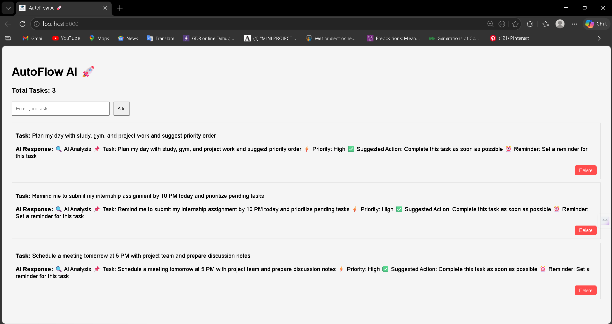
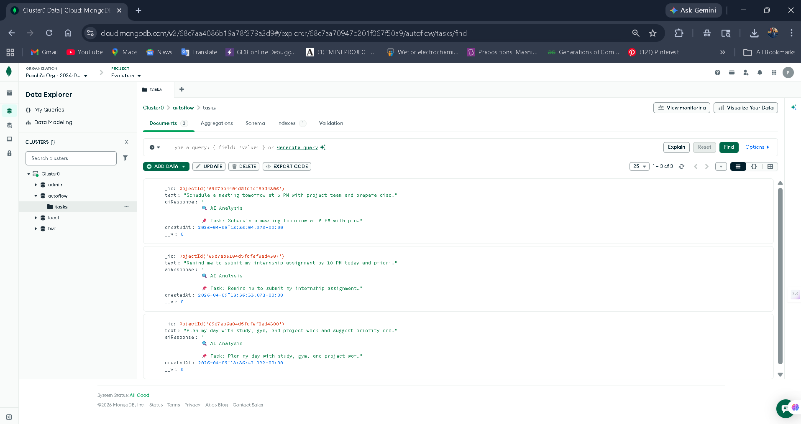

# 🚀 AutoFlow AI

### Intelligent Task Automation System

AutoFlow AI is a full-stack web application that transforms simple task management into an intelligent, automated workflow system. Instead of just storing tasks, it analyzes user input and provides actionable insights like priority, suggestions, and reminders.

---

## 🌟 Features

* ✅ **Smart Task Input** – Accepts natural language tasks

* 🤖 **AI-Based Analysis** – Generates priority, suggestions, and reminders

* 🚫 **Duplicate Prevention** – Avoids redundant entries

* 🗑️ **Task Deletion** – Full control over task lifecycle

* 💾 **Persistent Storage** – Data stored securely using MongoDB

* ⚡ **Clean UI** – Minimal and user-friendly interface

---

## 🧠 Project Overview

Traditional task managers only allow users to store tasks. AutoFlow AI goes beyond that by introducing an intelligent layer that understands user intent and generates meaningful outputs.

### 🔄 Workflow

```
User Input → API Request → Backend Processing → AI Analysis → Database Storage → UI Display
```

---

## 💡 Problem It Solves

Managing daily tasks can be overwhelming when there is no structured guidance. Users often:

* Forget deadlines
* Struggle with prioritization
* Lack clarity on what to do next

AutoFlow AI addresses this by converting natural language tasks into structured, actionable insights.

---

## ⚙️ Tech Stack

### Frontend

* React.js
* Axios

### Backend

* Node.js
* Express.js

### Database

* MongoDB Atlas

### AI / Automation

* AI-based task analysis (simulated fallback logic)
* Agentic workflow design (input → decision → output)

---

## 🏗️ System Architecture

```
Frontend (React)
       ↓
Backend API (Node.js / Express)
       ↓
AI Service (Task Analysis)
       ↓
Database (MongoDB)
       ↓
Response to UI
```

---

## 🔍 How It Works

1. User enters a task (e.g., "Schedule a meeting tomorrow at 5 PM")
2. The frontend sends the task to the backend
3. Backend processes it using an AI service
4. AI generates:

   * Priority
   * Suggested action
   * Reminder
5. Task is saved in MongoDB
6. UI displays structured output

---

## 🧩 Key Highlights

* Designed with **agentic workflow principles** (input → decision → action)
* Simulates **autonomous decision-making**
* Ensures **data persistence and consistency**
* Implements **full CRUD operations**
* Focuses on **clean UI + usability**

---

## 🔐 Security & Best Practices

* Environment variables stored in `.env`
* Sensitive data excluded using `.gitignore`
* Clean and modular folder structure

---

## 📸 Screenshots





---

## 🎥 Demo Video

(Add your Loom video link here)

---

## 🚀 Future Improvements

* Real AI integration (OpenAI / Gemini)
* Voice-based task input
* Smart scheduling & calendar sync
* User authentication system

---

## 🙌 Conclusion

AutoFlow AI demonstrates how a simple idea like task management can be transformed into a smart, intelligent system using modern full-stack development and automation concepts.

This project reflects my ability to build scalable applications, think in terms of workflows, and integrate intelligent logic into real-world solutions.

---
